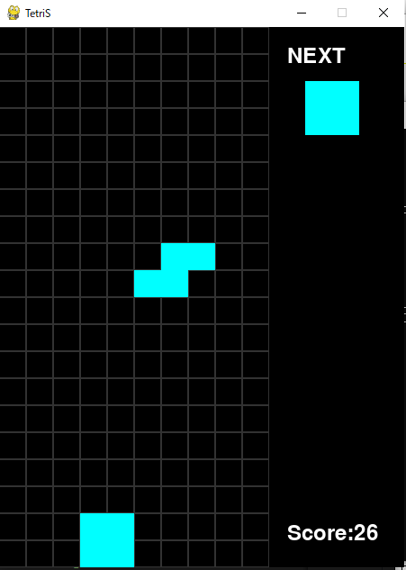
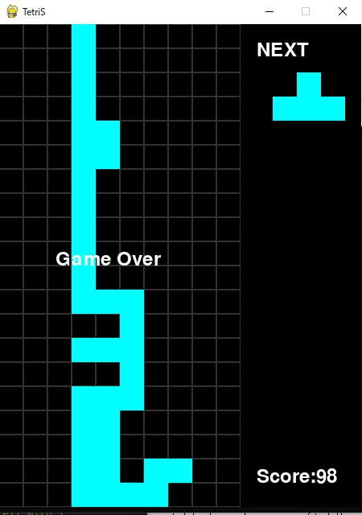

# Pygame_Tetris
#  English
## Project"Tetris" Overview
This game was developed to learn and understand Pygame,
as well as to enjoy playing it during my free time.

I reserched and analyzed Python and Pygame functions that
were necessary for this projact,
desassembled the parts I understand, and rebuild them
from scratch.

This is my first complete game created with Python and Pygame.
I designed the structure myself, organized the code into multiple modules, 
and implemented key features such as a scoring and a next-block display.

Through this project,I practiced breaking down functions, organizing code
into separate files, and improving readability by writing documentation in English.

----

## Features
・Display of the **NEXT** Block
・Scoring system:
     +1 point for each cell a block falls
     +100 points for each cleared row
・Moving blocks using four keybord keys  

----

## How to play 
**Controls**
・ ← Left Arrow: Move block left

・ → Right Arrow: Move block right

・↓ Down Arrow: Drop block one cell faster

・ R key: Rotate block clockwise 

**Game Objective**
・Stack tetriminos (blocks) to clear lines
・Gain points (+1 per dropped cell, +100 per cleared line)
・Continue stacking and clearing lines to achieve higher scores!

----

## Game Screenshot
| Game Playing | Game Over |
|:-------------:|:----------:|
|  |  |

----

## How to Run
This Tetris game is built with **Python** and **Pygame**.  
You don't need Anaconda to play — as long as you have Python installed, you're good to go! 🚀  

Start the game by running the command:
python main.py
 

----

## Code Design and Organization
・The code is divided and organized by function.
・I initially wrote comments in japanese for each section.
・Then I transelated all notes in english.
・These notes were originality for my own understanding, 
  but I later rewrote and organazed them for better readability.
・Additional reference notes for self-study are stored in the folder"tetris_detail_memos". 

----

## Game Design Ideas
**Block color: 
I chose cyan for the tetriminos.
Cyan is a calming color that helps players stay relaxed,
making it easier to plan block placement and contine playing.
  
**Next Block Display: 
The feature allows player to anticipate upcoming peaces. 
It encourages planning and makes gameplay smoother and more strategic.

**Scoring System:
The scoring feature adds excitement and a sense of achievement.
Players gain +1 point per dropped cell and +100 points per cleared line.
This rewards both persistence and success, keepin motivation high.

----

## Future Improvements
- Add a feature to display he highest score achieved by the player.
- Improve block rotation logic near walls.
- Add background music and sound effects.

------------------------------------------------------------------------------

#  日本語
## プロジェクト”Tetris”概要
このゲームはPygameを学び理解するために開発しました。
また分の自由時間に楽しく遊ぶために開発しました。
必要なPythonやPygameの関数を自ら調べ、
わからない部分は分解して理解し、再構築しました。

本作品は、Python・Pygameを使って構成を自分で設計し、
コードを複数のモジュールに整理して機能を実装した、
初めての完成版ゲームです。

このプロジェクトを通して、機能ごとにコードを整理し、
英語でドキュメントを作成して可読性を高める練習をしました。

----

## 機能
・NEXT ブロック画面を実装
・スコア　システム:
     ブロックが１マス落ちるごとに＋１点
     １列ブロックが消えるごとに＋１００点
・キーボード上の４つのボタンでブロックを動かす  

----

## 遊び方 
**コントロールキー

・←矢印キー :　ブロックを左に動かす

・→矢印キー :　ブロックを右に動かす

・↓矢印キー :　落ちる速度を速める

・R ボタン :　時計回りに９０度回転 

**ゲーム概要
・ブロックを組み合わせて列をどんどん消そう
・得点が入るよ（１マス落下ごとに＋１点、１列消えるごとに＋１００点）
・ブロックを積み上げながら列を消してハイスコアを目指そう！

----

## スクリーンショット画像
| Game Playing | Game Over |
|:-------------:|:----------:|
|  |  |

----

## 起動方法
PythonとPygameを使って作られたシンプルなテトリスゲームです。  
**Anacondaは不要**で、Pythonさえ入っていればどの環境からでも実行できます。

このファイルから起動してゲームをはじめよう:

"python main.py"
 

----

## コードに対しての工夫
・分割し機能ごとにコードを整理した
・始めにそれぞれの機能ごとに日本語でメモを書いた
・次に全てのメモを英語に翻訳した
・メモはわたしがゲームのコードを理解するために独自の書き方をした 
・後から誰でも見やすくなるよう書き直し整理した
・わたしが理解する為に作った追加のメモは"tetris_detail_memos"フォルダに入っている. 

----

## ゲーム内容に対しての工夫
**ブロックの色: 
シアン色を選択。
シアンはプレイヤーに癒しを感じさせる色で、
プレーヤーがブロックをどう並べるか計画したり、遊び続け易くしてくれる。
  
**次のブロックを表示する画面: 
この機能は次のブロックがどんな形なのかプレーヤーに予想させてくれるので、
プレーヤーがどのように列を消すか、より計画しやすくなり、ゲームが進めやすくなる。

**スコアシステム:
この機能はプレーヤーに喜びや達成感を与える。
ブロックが１マス落ちるごとに＋１点、１列消えるごとに＋１００点が与えられる。
プレーヤーの忍耐力や成功に対して得点が付与されることで、
プレーヤーのモチベーションが維持される。

----

## 次に工夫したい点
- プレイヤーの過去最高得点を表示する画面を加える。
- 壁に近いブロックの回転時のロジックを加える。
- 背景にBGMを流す。
